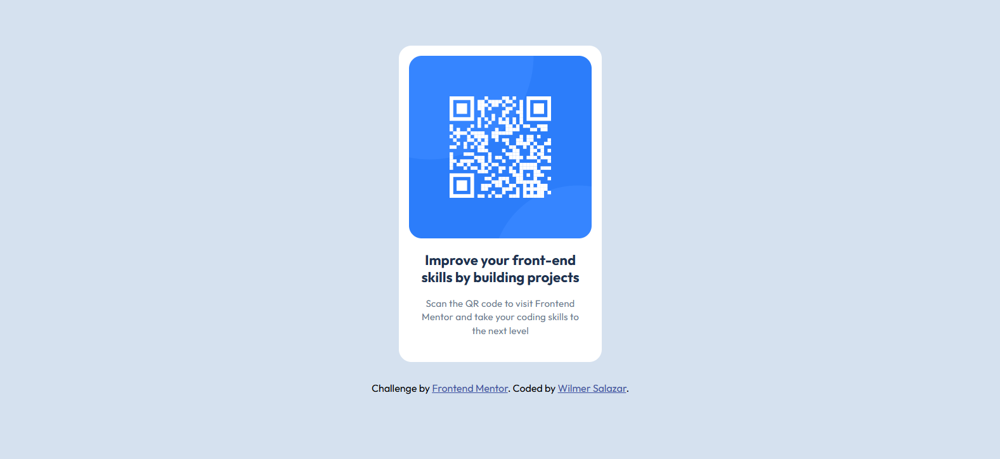

# Frontend Mentor - QR Code Component Solution

This is my solution to the [QR Code Component Challenge on Frontend Mentor](https://www.frontendmentor.io/challenges/qr-code-component-iux_sIO_H). This project helped me practice essential front-end development skills through a simple, yet effective design challenge.

## Overview

### Screenshot

## Built With

- Semantic HTML5 markup
- CSS custom properties
- Flexbox

## Author

- **GitHub:** [@wkatir](https://github.com/wkatir)
- **Frontend Mentor Profile:** [@wkatir](https://www.frontendmentor.io/profile/wkatir)